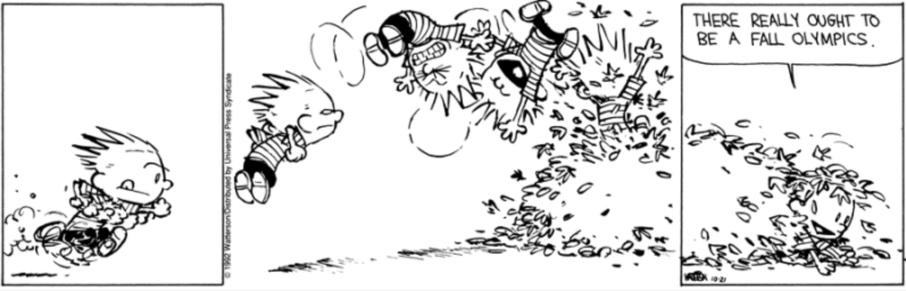

# Group 17 - Analyzing the History of the Summer and Winter Olympics

## Milestones

Milestone 1: Form a team and find a dataset

Milestone 2: Load your dataset, explain it, and define your research questions

Milestone 3: Exploratory Data Analysis (EDA)

Milestone 4: Visualizations, Analysis, and Pipeline

Milestone 5: Present your Dashboard!

## Describe your topic/interest in about 150-200 words

History is prominent topic in elementary to highschool education that focuses on critical and cruciual moments of the past that have shaped the pathways in today's society. Since the Olympics have been around since 776 B.C., they are a prominent topic in athletics. The Olympics were originally created to honour the ancient Greek Gods, but more specifically Zeus, who was known to be a ruler and protector. The Olympic games were also famously known to present the ancient Greek's passion for competition. Our topic of interest has been founded around analyzing the history and parameters of the Summer and Winter Olympics from 1986 to 2020. Our overall interests are focused on analyzing ideas such as correlations between competition. There is potential interest to also analyze the history behind Summer and Winter Paralympics from 1986 to 2020, depending on our vision statement for the project.

## Describe your dataset in about 150-200 words

The Olympics and Paralympics datasets that was found on kaggle.com containing data regarding the sport, games, medal, and country. The data was manually compiled from 1896-2022 and updated with each olympic game. The purpose of this dataset was to compile longitudinal data of Olympic games results to identify if any trends exist. Although our data set is large and complex, several variables will not be of use due to their un-needed detail; such as athlete profile websites. We have several goals the first of which is to identify wether or not being to host country offers a competitive advantage, secondly if any country shows outstanding sport prowess, and finally if any countries are better at the winter or summer games. We all have our own specific questions we would like to answer however they each aim to answer if a country's demographics, or weather predispose them to performing better at the Olympic games. 

## Team Members

- Dylan Forsythe: I read a lot of manga and love to play board games.
- Conan Shing: I am a professional photographer and love riding my bike and climbing mountains.
- Cynthia Kielpinski: I adore everything and anything outdoors including skiing, hiking, and wildlife photography! When I am not outside I enjoy applied statistics, GIS, and board games.

## Images

{You should use this area to add a screenshot of an interesting plot, or of your dashboard}

## References

- https://www.kaggle.com/datasets/piterfm/olympic-games-medals-19862018?select=olympic_medals.csv

- The related datasets inside the above link are also included to ensure we have all of the information as well as ensure licenses are
