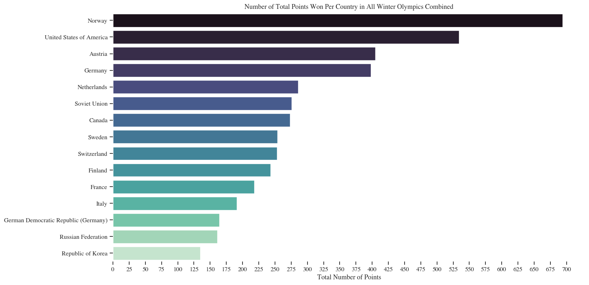
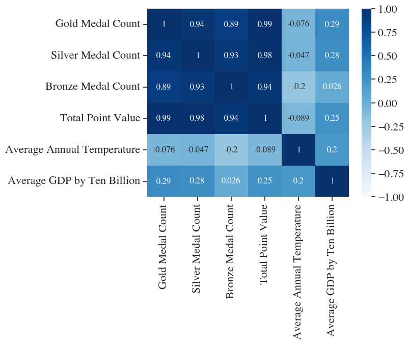

---
---
## **DATA301: Introduction to Data Analytics**
---
### **Cumulative Report for Course Project** 
#### **Cynthia Kielpinski: April 6th, 2023**
---
### **INTRODUCTION:**  
Athletics is a prominent topic in education, there is always some focus on healthy lifestyles and exercising. With this, most inidividuals growing up participate in some level of athletics, and at least at one point of someone's athletic career they would think about either participating at a varsity or Olympic level. With this mindset, this was one of the reasons we as a group chose this dataset to focus our analyses on. Specifically for myself, I am more interested in environmental and ecological topics, however I did competitvely swim and ski while I was younger. 
Thus, my initial research question is focused on how climate affects the per formance of a country in the Olympics. My second research question is focused on, if climate wasn't influencial on success, what may be influential? From this observation, I selected average gross domestic product as my predictor, since money always seems to have an effect on one thing or another.   
### **EXPLORATORY DATA ANALYSIS:**  
Exploratory data anlaysis allows one to obtain an understanding towards what the data can tell you, with minimal programming and analysis. EDA is known as the introduction to analyses, and is often helpful to providing insight into how to further your analyses and set the pathway for one's analyses pipeline. Below you will find some of the following visualizations that allowed for exploratory data analysis to be conducted. For each of the Winter and Summer Olympics, there will be a bar graph specifying the top fifteen standings for all the Olympics between the years of approximately 1989 to 2020. Additonally, a correlation plot including the parameters being compared between countries has also been included. 
#### **Winter Olympics:**  
 
**Figure 1:** Overall Standings for Winter Olympics (Combined Standings) 
This plot explains the top 15 standings for the winter Olympics combined for approximately the years 1989 to 2020. The top three performing countries are: Norway, United States, and Austria.
 
**Figure 2:** Correlation Plot for Winter Olympics Parameters being Compared 
Here, the correlation plot above describes that average annual temperature has no correlation with the other following parameters, whereas average GDP has a slight postive correlation. 
#### **Summer Olympics:**  
 
**Figure 3:** Overall Standings for Summer Olympics (Combined Standings) 
This plot explains the top 15 standings for the summer Olympics combined for approximately the years 1989 to 2020. The top three performing countries are: United States, Soviet Union, and Great Britian.
 
**Figure 4:** Correlation Plot for Summer Olympics Parameters being Compared 
Here the correlation plot specifies that the average annual temperature has no correlation with any of the other parameters, whereas the average GDP has a significant positive correlation.
### **RESEARCH QUESTION ONE:**  
*Does the average annual temperature of a country determine a correlation between the probability or likelihood of performing more successfully in the winter or summer Olympics in individual disciplines?*  
For example, does Canada have a higher likelihood of performing more successfully at the winter Olympics due to their climate being colder on average? Does Brazil have a higher likelihood of performing more successfully at the summer Olympics due to their climate being warmer on average? Or is there no associated likelihood of success when climate is presented as an explanatory variable?  
### **RESULTS FOR QUESTION ONE:**  
#### **Winter Olympics:**  
 
Figure 5: Average Annual Temperature Regressed on Total Point Value for Winter Olympics. (R-Squared Value: 0.081    P-Value: 0.368)   
Overall, from the R-squared and p-value, the results from this regression model are not significant. However, it can seen that there is a slight negative linear relationship between the average annual temperature and the total point value for the winter Olympics. As average temperature increases, the total point value decreases.
#### **Summer Olympics:**  
  
Figure 9: Average Annual Temperature Regressed on Total Point Value for Summer Olympics. (R-Squared Value: 0.047    P-Value: 0.498)   
Overall, from the R-squared and p-valus above, we can reference that the results from the regression plot are insignificant, and we cannot confidently confirm any results from the plot further. However, it can be seen that there is a slight negative linear relationship, where as average annual temperature increases, the total point value decreases. The highlighted pink bar represents the confidence interval for the trend line which appears to have some variance but nothing too drastic.
### **RESEARCH QUESTION TWO:**  
*If we decide to reject the first research question due to insufficient probability/likelihood; is a countries success determined by the average gross domestic product (GDP) of the country?*  
For example, if a countries average GDP is higher, does that mean the country has a greater level of success? Or if a countries average GDP is higher, does that mean the counter have a lesser level of success? Or, does some other combination of GDP and success exist? 
### **RESULTS FOR QUESTION TWO:**  
#### **Winter Olympics:**  
 
**Figure 13:** Average Gross Domestic Product Regressed on Total Point Value for Winter Olympics. (R-Squared Value: 0.068   P-Value: 0.410)   
Overall, by observing the R-squared value and the p-value of the model, none of these values are significant, implying the model is insignificant. Here there is a positive relationship between average GDP and Total Point Value for the Winter Olympics. As average GDP increases, so does the total point value for each country. The results of the trend line may not be significant, but you can see there is a positive linear relationship between the two parameters.  
#### **Summer Olympics:**  
  
**Figure 17:** Average Gross Domestic Product Regressed on Total Point Value for Summer Olympics. (R-Squared Value: 0.88    P-Value: <0.0001)   
Overall, by comparing the R-Squared value with the p-value, this is the only regression model out of my entire analyses which was significant. In this plot, it can be observed that there is a significant positive linear relationship associated with GDP and Total Point Value for the Summer Olympics. This implies that as the average GDP of a country increases, so does the total point value for each country. The highlighted orange bar is the confidence interval which is quite large even though the small number of data points, this further implies that the variance associated with the model is going to be greater than lesser. From this plot, we can conclude our only significant result of that in the summer Olympics, average GDP is significant when predicting a countries success.   
### **CONCLUSION OF PROJECT:**  
In final, to answer my two research questions, the results were definitely not what I predicted the outcome would be, however, they did yield a response. Overall, I do not think that climate has an influence on the probability of determining a countries success at either the winter or summer Olympics. Similar, I would suspect that average gross domestic product also doesn't yield an influence on a countries success at the winter or summer Olympics. In the entirety of my analyses, when regressing average GDP by total point value for the summer Olympics was the only significant model. Does this make me think that average GDP has a significant effect for a countries success in the Olympics? No, definitely not. (Note: Gold, Silver, and Bronze Medal Counts also yielded significant results but were not presented in final report.) Ultimately, I think that it isn't the climate or the GDP that has an influence of whether a country wins at the Olympics or not. I think it is the individual athletes dedication to their sport in which fuels the success of the country. The more dedicated athletes, the more time, money, and effort are spent improving their abilities. Climate may influence the choosing of one's sport, whereas the GDP of a country may determine the amount of money that can be allocated for athletic and Olympic funding for that specific country.