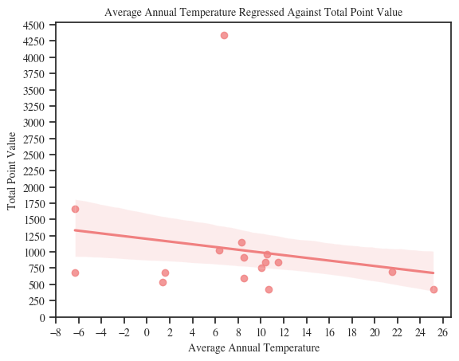
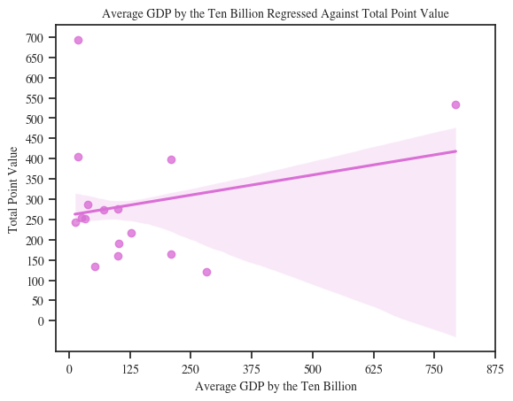
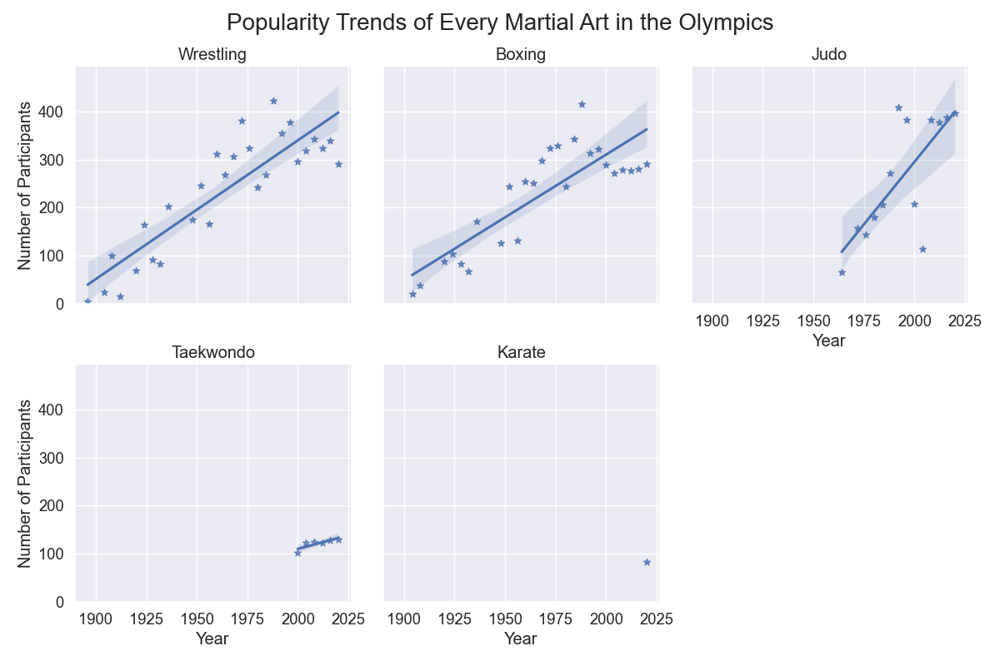

---
---
## **DATA301: Introduction to Data Analytics**
---
### **Cumulative Report for Course Project** 
### **Group 17**
#### **Cynthia Kielpinski: April 6th, 2023**
---
### **INTRODUCTION:**  
Athletics is a prominent topic in education, where there is always some focus on healthy lifestyles and exercising. With this, most inidividuals growing up participate in some level of athletics, and at least at one point of someone's athletic career they would think about either participating at a varsity or Olympic level. With this mindset, this was one of the reasons we as a group chose this dataset to focus our analyses on. When the topic at hand is relatable or easy to form connections with, it is often easier to complete tasks than when no connections can be formed. Specifically for myself, I am more interested in environmental and ecological topics, however I did competitvely swim and ski while I was younger. Thus, my initial research question is focused on how climate affects the per formance of a country in the Olympics. My second research question is focused on, if climate wasn't influencial on success, what may be influential? From this observation, I selected average gross domestic product as my predictor, since money always seems to have an effect on one thing or another. 
### **EXPLORATORY DATA ANALYSIS:**  
Exploratory data anlaysis allows one to obtain an understanding towards what the data can tell you, with minimal programming and analysis. EDA is known as the introduction to analyses, and is often helpful to providing insight into how to further your analyses and set the pathway for one's analyses pipeline. Below you will find some of the following visualizations that allowed for exploratory data analysis to be conducted. For each of the Winter and Summer Olympics, there will be a bar graph specifying the top fifteen standings for all the Olympics between the years of approximately 1989 to 2020. Additonally, a correlation plot including the parameters being compared between countries has also been included. 
#### **Winter Olympics:**  
 
**Figure 1:** Overall Standings for Winter Olympics (Combined Standings) 
This plot explains the top 15 standings for the winter Olympics combined for approximately the years 1989 to 2020. The top three performing countries are: Norway, United States, and Austria.
 
**Figure 2:** Correlation Plot for Winter Olympics Parameters being Compared 
Here, the correlation plot above describes that average annual temperature has no correlation with the other following parameters, whereas average GDP has a slight postive correlation. 
#### **Summer Olympics:**  
 
**Figure 3:** Overall Standings for Summer Olympics (Combined Standings) 
This plot explains the top 15 standings for the summer Olympics combined for approximately the years 1989 to 2020. The top three performing countries are: United States, Soviet Union, and Great Britian.
 
**Figure 4:** Correlation Plot for Summer Olympics Parameters being Compared 
Here the correlation plot specifies that the average annual temperature has no correlation with any of the other parameters, whereas the average GDP has a significant positive correlation.
### **RESEARCH QUESTION ONE:**  
*Does the average annual temperature of a country determine a correlation between the probability or likelihood of performing more successfully in the winter or summer Olympics in individual disciplines?*  
For example, does Canada have a higher likelihood of performing more successfully at the winter Olympics due to their climate being colder on average? Does Brazil have a higher likelihood of performing more successfully at the summer Olympics due to their climate being warmer on average? Or is there no associated likelihood of success when climate is presented as an explanatory variable?  
### **RESULTS FOR QUESTION ONE:**  
#### **Winter Olympics:**  
 
Figure 5: Average Annual Temperature Regressed on Total Point Value for Winter Olympics. (R-Squared Value: 0.081    P-Value: 0.368)   
Overall, from the R-squared and p-value, the results from this regression model are not significant. However, it can seen that there is a slight negative linear relationship between the average annual temperature and the total point value for the winter Olympics. As average temperature increases, the total point value decreases.
#### **Summer Olympics:**  
  
Figure 9: Average Annual Temperature Regressed on Total Point Value for Summer Olympics. (R-Squared Value: 0.047    P-Value: 0.498)   
Overall, from the R-squared and p-valus above, we can reference that the results from the regression plot are insignificant, and we cannot confidently confirm any results from the plot further. However, it can be seen that there is a slight negative linear relationship, where as average annual temperature increases, the total point value decreases. The highlighted pink bar represents the confidence interval for the trend line which appears to have some variance but nothing too drastic.
### **RESEARCH QUESTION TWO:**  
*If we decide to reject the first research question due to insufficient probability/likelihood; is a countries success determined by the average gross domestic product (GDP) of the country?*  
For example, if a countries average GDP is higher, does that mean the country has a greater level of success? Or if a countries average GDP is higher, does that mean the counter have a lesser level of success? Or, does some other combination of GDP and success exist? 
### **RESULTS FOR QUESTION TWO:**  
#### **Winter Olympics:**  
 
**Figure 13:** Average Gross Domestic Product Regressed on Total Point Value for Winter Olympics. (R-Squared Value: 0.068   P-Value: 0.410)   
Overall, by observing the R-squared value and the p-value of the model, none of these values are significant, implying the model is insignificant. Here there is a positive relationship between average GDP and Total Point Value for the Winter Olympics. As average GDP increases, so does the total point value for each country. The results of the trend line may not be significant, but you can see there is a positive linear relationship between the two parameters.  
#### **Summer Olympics:**  
  
**Figure 17:** Average Gross Domestic Product Regressed on Total Point Value for Summer Olympics. (R-Squared Value: 0.88    P-Value: <0.0001)   
Overall, by comparing the R-Squared value with the p-value, this is the only regression model out of my entire analyses which was significant. In this plot, it can be observed that there is a significant positive linear relationship associated with GDP and Total Point Value for the Summer Olympics. This implies that as the average GDP of a country increases, so does the total point value for each country. The highlighted orange bar is the confidence interval which is quite large even though the small number of data points, this further implies that the variance associated with the model is going to be greater than lesser. From this plot, we can conclude our only significant result of that in the summer Olympics, average GDP is significant when predicting a countries success.   
### **CONCLUSION OF PROJECT:**  
In final, to answer my two research questions, the results were definitely not what I predicted the outcome would be, however, they did yield a response. Overall, I do not think that climate has an influence on the probability of determining a countries success at either the winter or summer Olympics. Similar, I would suspect that average gross domestic product also doesn't yield an influence on a countries success at the winter or summer Olympics. In the entirety of my analyses, when regressing average GDP by total point value for the summer Olympics was the only significant model. Does this make me think that average GDP has a significant effect for a countries success in the Olympics? No, definitely not. (Note: Gold, Silver, and Bronze Medal Counts also yielded significant results but were not presented in final report.) Ultimately, I think that it isn't the climate or the GDP that has an influence of whether a country wins at the Olympics or not. I think it is the individual athletes dedication to their sport in which fuels the success of the country. The more dedicated athletes, the more time, money, and effort are spent improving their abilities. Climate may influence the choosing of one's sport, whereas the GDP of a country may determine the amount of money that can be allocated for athletic and Olympic funding for that specific country.  

---
#### **Dylan Forsythe** 
### **INTRODUCTION:**  
Throughout the majority of someone's childhood, sports are introduced as a form of exercise to help with their development and growth. But why is it that some sports are presented more often than others? For example, why does it seem like everyone has played soccer at some point in their life, but a sport like speed skating, or judo hasn't? My analysis was constructed to observe the historical popularity trends of various sports in both the Summer and Winter Olympics to see which ones are seen as the "most popular". The way that I envisioned presenting this was to consider linear regression plot on the number of participants in a sport over time. 
### **EXPLORATORY DATA ANALYSIS:**  
With the help of exploratory data analysis, someone is able to interpret and manipulate raw data to infer a summary of the data that they have at their disposal. Since our data is from a collection of datasets, I first wanted to find the columns in each dataset to see which ones I thought would be important to analyzing popularity trends. Once I found which columns were common, i.e. at least two columns from two seperate datasets that contained the same information, I merged them together resulting in a single dataset with all of the information I needed. With my EDA, not only did I discover missing data during 1912-1916 and 1940-1944 because of the World Wars, I found that one of the columns, for team sports, contained two athlete names and each of their bios as a url together as a tuple. The whole column consistently contained only 2 athletes which did not make sense for sports with more than 2 people (hockey, volleyball, etc.). It was because of this that I decided to limit my analysis to individual sports. The figures are the results of my findings. 
### **RESEARCH QUESTION 1.1:** 
**How has the popularity of snowboarding and all of the skiing events changed over time?** 
 
*Figure 1*: My first graph interprets the number of participants in snowboarding and the various skiing sports per year. As you can see, some of these sports have been a part of the Olympics for much longer than others. Namely, snowboarding and freestyle skiing were only introduced in the 1990's so the number of participants is much lower than cross country skiing, alpine skiing, and biatholon. However, all of these sports have seen an increase in participants over the years. Based on this graph, the most popular sport in this selection can be determined to either alpine skiing or cross country skiing. Alpine skiing has, for the most part, consistently had the most participants when compared to cross country skiing. This wasn't the case in 1936, 1998, and 2022.  
### **RESEARCH QUESTION 1.2:** 
**How have the popularities of solo skating events changed over time?**  
 
*Figure 2*: These graphs isolate the the three solo skating sports to better identify the change in participants over the years. Between 1992 and 1994, we see a large popularity increase in short track speed skating while the popularity of speed skating decreases. Just by comparing these two trends, we see a negative correlation between the two. As for whether or not participants are making the switch to short track speed skating or some other factor is in play here, there is no way to determine that information from this dataset. Overall, I have determined that speed skating is the most popular solo skating sport, however short track speed skating appears to be gaining more participants lately indicating that it may surpass speed skating at some point in the future.  
### **RESEARCH QUESTION 1.3:** 
**What are the popularity trends for martial arts sports in the Olympics?** 
 
*Figure 3*: The linear regression plots of all of the martial arts sports show some interesting information. We clearly see that wrestling, boxing, and judo have been a part of the Olympics for a number of years already showing a steadily increasing trend in participants every decade. Since the three sports mentioned above all seem to be hovering around the same number of participants in recent years, its a little more difficult to determine which one is the most popular. Simply basing the decision off of the slope of the trend line, judo comes out on top. However, it has only been in the Olympics for half the time as the other two. Because of this, I am more inclined to give the title of "Most Popular Martial Art" to wrestling. A quick observation of the other two graphs shows that karate has only been a part of the Olympics once before, in 2020.  

---
### **RESEARCH QUESTION 2:** 
**In the history of the Olympic Games, how many people won an Olympic medal in their first appearance?** 
 
*Figure 4*: This figure shows the distribution of those that won an Olympic medal in their first appearance in an Olympic event. Considering that there are over 150 thousand participants across the history of the Olympics, I have determined there to be 7208 athletes to achieve this feat. Since the dataset is so large and the chances of there being a few values that exhibit inaccurate data, I have determined this number to represent there being approximately a 5% chance that a new athlete wins a medal in their first Olympic games. Another note on the distribution of my findings, I expected to see far less gold medals than silver and bronze medals but the difference was only off by a couple hundred. 
### **CONCLUSION OF ANALYSIS PROJECT:** 
In conclusion, popularity is difficult to determine based simply on the number of participants because many other factors are not included, such as: the number of people that tune in to watch each sport, the difficulty of the sport, or the cost to even play the sport. Many of these factors could influence the popularity of sports. With that in mind, my analysis solely looks at how the number of people entering the sport changed over time to see which ones could be classified as the "most popular". Due to there being a large amount of unique sports, plotting them all on a single graph would look extremely messy. Thus, I split up my analysis to look at "similar" sports. That way, my graphs are readable and eliminate comparing completely unrelated sports to each other.
My first research subquestion analysis found that alpine skiing and biatholon are amongst the most popular snow sports. My next subquestion analysis found that the most popular solo skating sport has been speed skating. Then my last subquestion found that the martial arts worlds of wrestling, judo, and boxing are neck-and-neck in popularity, however judo has seen the quickest increase in pariticipants of the three.
My second research question was more of a quick analysis that I found while performing my EDA. The number of people to earn an Olympic medal in their first appearance was only 7208 in the history of the Olympics. Since our dataset spans over 120 years, I was surprised to find that this represents approximately 5% of all people that have ever been a part of the Olympics.

---
#### **Conan Shing** 
#### **Date: April 10 2023**
---
### **INTRODUCTION:**  
Sex diffrences and more recently gender diffrences in almost all fields exist. Historically academic research, normative studies, and predicvtive values have disproportiantly consited of males. My background in cardiovascular clincal research was no diffrent and I hoped to bring my intrest in comparing physiological diffrences in biological sex to this project. Sports have always been a big part of my life and continue to be, however there has always been a gender disparity in sport and thats what I aimed to answer with this project. My goal was to look at medal winners, and athlete attendnace at a variety of games to both see how gender diffrences changed over time and more specifically compared the gender diffrences at the recent 2022 games. 

### **EXPLORATORY DATA ANALYSIS:**  
Exploratory data analysis invovles digging around in your data and idnetifiying gross trends that might appear. In many cases its very rudimentary and it's only function is to provide us with a direction to investigate further. In order to answer my questions (listed below) I needed to wrangle and merge several data frames to combine game locations, medal winners, and athelte demographics. Initially my questions invovolved identifying how well the number of times hosting a games impact how well the country does at the games (*Figure 1, 2*). Once I had completed my inital EDA I found that this was a far too simplistic question and found I was able to just visually compare the 2 top 10 countries. Knowing that I switched gears to investigate sex diffrences in all time medal winning countries as well as comparisions between athlete attendace and medal winners (Figure 2). As I switched to this direction it invoved the addition of several caluclated columns which would allow me to compare male and female metrics. Below I outline my findings...

 
*Figure 1*: Top 10 all time medal winners 

 
*Figure 2*: Number of times each country has hosted a games seperated by season

### **RESEARCH QUESTION 1:** 
#### **How does the ratio of male and female medal winners change over time in the top country at each games?**

It appears for the most part men have dominated the number of medals won by the top country each year, however this trend appears to be changing following 1996 with women appearing to contribute a similar ammount of medals to the total medal count as men (*Figure 3*). This may be due to the increase ammount of females both participating in sport and being allowed to participate in sport. Historcally women have been banned from high performance sport, and despite still facing challanges today the barriers they face have been reduced. 

 
*Figure 3*: Male and female medal winner composition of the top country at each games. 

Notably in 1994 biannual games began (winter and summer) as opposed to games every 4 years. The signficnatly lower number of medals is attributed to the reduced number of medals up for grabs in the winter games when compared to the summer games. 

I was able to quantify if males the diffrence in males and female medal winners is improving as shown in (*Figure 4*). This plot confirms that at after 1996 females were able to either win more medals than men at that games or at least close the gap between genders.

 
*Figure 3*: Diffrence in male and female medals won in the top medal winning country at each games. Red line: diffrnece in male and female medal winners; Dotted line: equal male and female medals won.  

Limitations do exist for this analysis with the potential for lost data and improer recording earler on in the games being a real possibilty. There is also possibly an easy explanation for the reason why women appear to be able to match men in medal performance as womens rights and female attendnace advocacy dramatically increased at that time. There is also missing data during the 2 world wars. 

### **RESEARCH QUESTION 2:** 
#### **How does the times hosting a games improve a country's medal winning performance?**

To answer this question I first set out to identify who were the top 10 medal winning countries of all time (*Figure 5*). I then identified how many time each host country hosted a games (*Figure 6*). 

 
*Figure 5*: Top 10 medal winners of all time

 
*Figure 6*: Number of times each host country has hosted a games 

With these 2 figures I was able to visually compare how the 2 overlaped and found only a few of the top 10 medal winners were also top 10 hosts (US, France, Great Britain). Notably the order was also not the same as I had intially predicted. Knowing this I decided to conduct a non linear regression to idnetify if any relationship exists (*Figure 7*). This image shows that for the most part no trend exists, with there potentially being a slight relationship at higher numbers of times hosting. As there only seems to be small relationship I can conclude that although hosting more times CAN improve your chance of winning more medals however there are probably several more factors that would contribute. 

 
*Figure 7*: Non linear regression model of medals won and times hosting a games. Blue circles: individual countries; Black line: non-linear regression; shaded area: 95% confidence interval. 

### **RESEARCH QUESTION 3:** 
#### **Are there more males vs females sent to the games and if so do the ammount of medals won related to the number of athletes sent?**

To answer this question I firt wanted to see the diffrence in male and female athelte attendance to the 2022 games. I chose the 2022 games because it was the most recent and had readily avilable accurate data.When I ploted male and female athlete attendance I saw there seemed to be realativly even number of male and female athletes sent (*Figure 8*) 

 
*Figure 8*: Number of male and female athletes sent to 2022 games by each country 

Knowing that there was a similar number of athletes in attendance I then decided to calcualte linear regressions to determine if there was a diffrnece in the relationship between male and female medal winners (*Figure 9, 10*). When plotted females appeared to have a steeper regression (0.2 vs 0.1) suggesting a steeper relationship for females. This plot suggests the for every female athlete that is sent to the game they do better than every male athelte that is sent to the games.

 
*Figure 9*: Linear regression model of male athletes sent vs medals won 

 
*Figure 10*: Linear regression model of female athletes sent vs medals won

Next I decided to zoom in to look at the top 10 male and female medal winner countries to invesigate how many medals were won for the atheltes that were sent (*Figure 11, 12*). What I found was there does not appear to be a strong correlation between the number of athletes sent and number of medals won...at least visually. This is confirmed by the previous regressions as they both have a very low slope suggesting a weak relationship between the 2 variables. 

 
*Figure 11*: Comparision of medals won vs athletes sent for men

 
*Figure 12*: Linear regression model of female athletes sent vs medals won
Comparision of medals won vs athletes sent for women

### **Conclusion of Analysis Project:** 

In conclusion, the questions answered here are not the ones I had initally set out to answer. By pivoting to compare sex diffrences I found results that did not align with my expectations. Although I can conclude that there have been more males than females sent to the games with this discrepincy changing in recent years I did not expect to see such a weak relationship between athlete attendance and medals won of each country. I was shocked to find that females had a steeper relationship compared to males, however this finding needs to be taken with a grain of salt as the slopes are very weak to begin with and this likely would not repersent a statistical difference. A similar weak finding was present when I compared the number of times hosting to total medals won. In conclusion I can say that female athelte attendance is trending upwards with as well as medals winners however the relationship between athlete attednance and medals won remains weak and potetinally statistically insignificant. 